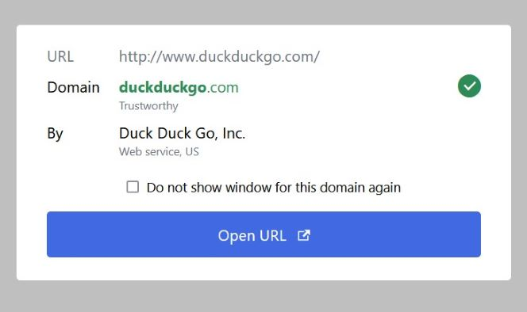
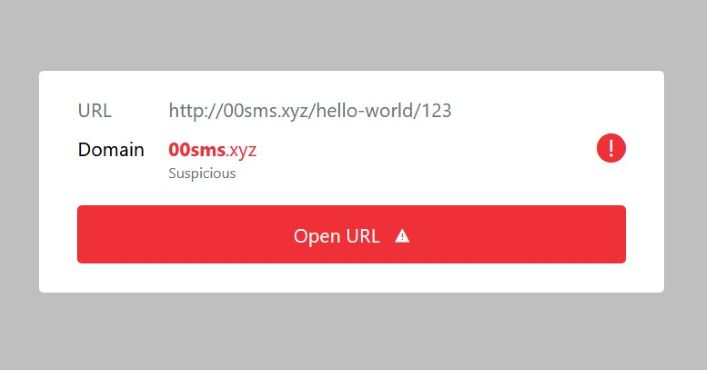

# Safelink Extension for Thunderbird

This extension protects you against phishing and malicious links in emails. Instead that an website is open right after a click, a window shows you all important information about a domain before you enter the web.

## Screenshots

## Developement

To start developing,

1. clone repo,

2. install dependencies with `npm install`,

3. build extension with `npm run build` or `npm run watch`

### Create installable package

To package the extension for ready use in Thunderbird use `npm run package`.

## Licence

[GPLv3](./licence.txt)
