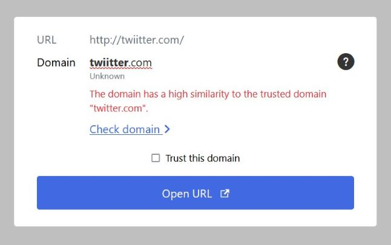

<h1 align="center">
  
    
  
  Safelink Extension
</h1>

    Thunderbird •
    <a href="https://github.com/jballmann/safelink-outlook">Outlook</a>

This extension protects you against phishing and malicious links in emails. Instead that an website is open right after a click, a window shows you all important information about a domain before you enter the web.

## Screenshots

## Development

To start developing,

1. clone repo,

2. install dependencies with `npm install`,

3. build extension with `npm run build` or `npm run watch`

### Create installable package

To package the extension for ready use in Thunderbird use `npm run package`.

## License

[GPLv3](./LICENSE)
